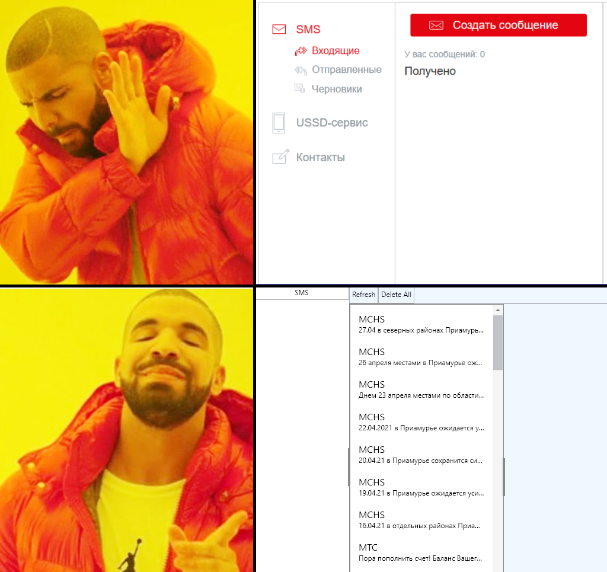

# MTSVobisAvalonia
Temporarily solution for who cant look received SMS in web console of MTS modem 8810FT. This program is pretty simple (only SMS data parser, update state timer for each sec, and simple management SMS).

### Features
* Autoupdate status of Modem
* Fetch the received SMS automatically
* Ability to use other IP address of modem
* View SMS
* Delete SMS

### Dependencies
* [Microsoft DotNET Core 3.1](https://dotnet.microsoft.com/download/dotnet/3.1/runtime) 

### Download
* [Go to Releases](https://github.com/appleneko2001/MTSVobisAvalonia/releases)

### Meme about web console of MTS 8810FT

